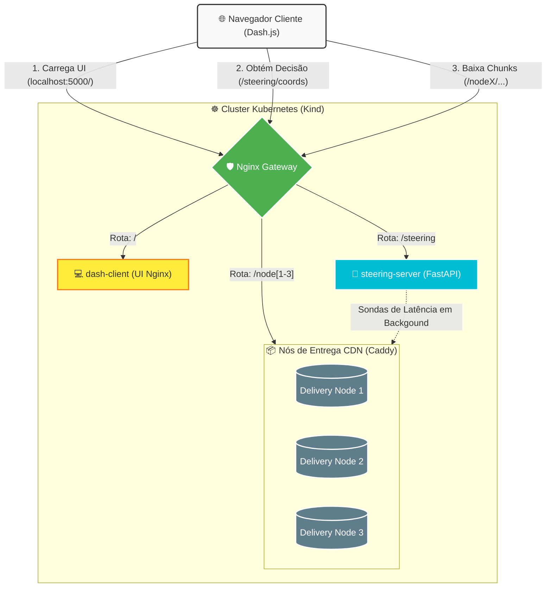

<a id="readme-top"></a>

<!-- ESCUDOS DO PROJETO -->
[![Contributors][contributors-shield]][contributors-url]
[![Forks][forks-shield]][forks-url]
[![Stargazers][stars-shield]][stars-url]
[![Issues][issues-shield]][issues-url]
[![MIT License][license-shield]][license-url]
[![LinkedIn][linkedin-shield]][linkedin-url]

<!-- LOGOTIPO DO PROJETO -->
<br />
<div align="center">
  <a href="https://github.com/alissonpef/Content-Steering">
    
  </a>

  <h3 align="center">Content Steering com Aprendizado por Reforço (DASH)</h3>

  <p align="center">
    Ambiente de simulação nativo em Kubernetes para avaliação de estratégias de Content Steering em streaming de vídeo DASH utilizando algoritmos de Aprendizado por Reforço sob latências de rede reais.
    <br />
    <a href="https://github.com/alissonpef/Content-Steering"><strong>Explore a documentação »</strong></a>
    <br />
    <br />
    <a href="https://www.youtube.com/watch?v=HVMiex63daY">Ver Demonstração</a>
    &middot;
    <a href="https://github.com/alissonpef/Content-Steering/issues/new?labels=bug&template=bug-report---.md">Reportar Bug</a>
    &middot;
    <a href="https://github.com/alissonpef/Content-Steering/issues/new?labels=enhancement&template=feature-request---.md">Solicitar Recurso</a>
  </p>
</div>

<!-- ÍNDICE -->
<details>
  <summary>Índice</summary>
  <ol>
    <li>
      <a href="#sobre-o-projeto">Sobre O Projeto</a>
      <ul>
        <li><a href="#construído-com">Construído Com</a></li>
      </ul>
    </li>
    <li>
      <a href="#começando">Começando</a>
      <ul>
        <li><a href="#pré-requisitos">Pré-requisitos</a></li>
        <li><a href="#instalação">Instalação</a></li>
      </ul>
    </li>
    <li><a href="#arquitetura">Arquitetura</a></li>
    <li><a href="#uso">Uso</a></li>
    <li><a href="#pipeline-de-análise">Pipeline de Análise</a></li>
    <li><a href="#contribuindo">Contribuindo</a></li>
    <li><a href="#licença">Licença</a></li>
    <li><a href="#contato">Contato</a></li>
    <li><a href="#agradecimentos">Agradecimentos</a></li>
  </ol>
</details>

<!-- SOBRE O PROJETO -->
## Sobre O Projeto

[![Captura de Tela do Produto][product-screenshot]](https://github.com/alissonpef/Content-Steering)

Este projeto simula o mecanismo de **Content Steering** em streaming adaptativo DASH usando múltiplas estratégias de decisão inteligente. O objetivo principal é treinar e avaliar algoritmos de Aprendizado por Reforço (como Multi-Armed Bandits e PPO) para selecionar dinamicamente a melhor fonte de entrega (CDN) com base nas flutuações de latência, jitter e bufferbloat em tempo real.

Principais recursos:
* **Servidor de Steering em FastAPI** contendo as estratégias:
  * `epsilon_greedy` (MAB clássico)
  * `ucb1` (Upper Confidence Bound)
  * `linucb` (Contextual Bandit)
  * `thompson_sampling` (Contextual Thompson Sampling)
  * `ppo_hybrid` (Algoritmo de política híbrida para bitrate + steering)
  * `round_robin`, `random`, `no_steering` e `oracle_best_choice` (baselines)
* **Ambiente Kubernetes nativo (Kind)** para emulação e isolamento de rede real entre os pods.
* **3 servidores de cache simulados (Delivery Nodes)** usando Caddy para entrega local via HTTPS.
* **Pipeline automatizado de testes** com orquestração via Playwright em navegadores Headless.
* **Módulo completo de análise** para agregação de logs e geração de gráficos estatísticos com qualidade de publicação.

<p align="right">(<a href="#readme-top">voltar ao topo</a>)</p>

### Construído Com

Abaixo estão listadas as tecnologias e ferramentas utilizadas para construir este ecossistema:

* [![Python][Python-shield]][Python-url]
* [![FastAPI][FastAPI-shield]][FastAPI-url]
* [![Kubernetes][Kubernetes-shield]][Kubernetes-url]
* [![Docker][Docker-shield]][Docker-url]
* [![Playwright][Playwright-shield]][Playwright-url]
* [![Nginx][Nginx-shield]][Nginx-url]
* [![Caddy][Caddy-shield]][Caddy-url]

<p align="right">(<a href="#readme-top">voltar ao topo</a>)</p>

<!-- COMEÇANDO -->
## Começando

Siga as instruções a seguir para configurar e executar a simulação localmente no seu ambiente de desenvolvimento.

### Pré-requisitos

Para rodar este simulador, você precisará de:
* **Sistema Operacional**: Linux (recomendado Ubuntu/Debian) ou WSL2 no Windows.
* **Gerenciador de Dependências Python**: `uv` instalado localmente.
  ```sh
  curl -LsSf https://astral.sh/uv/install.sh | sh
  ```
* **Docker** e **Kind** instalados e em execução.
* **kubectl** para gerenciamento de recursos do Kubernetes.
* **mkcert** para geração de certificados SSL locais confiáveis:
  ```sh
  sudo apt install mkcert
  mkcert -install
  ```

### Instalação

1. Clone o repositório do projeto:
   ```sh
   git clone https://github.com/alissonpef/Content-Steering.git
   ```
2. Instale as dependências de Python do projeto de forma isolada com o `uv`:
   ```sh
   uv sync
   ```
3. Obtenha a pasta de dataset necessária:
   * Baixe os arquivos do dataset do [Google Drive Link](https://drive.google.com/drive/folders/1_Mh1JDoRroikzJnjCsZ-Qgqdbx-XP78N?usp=sharing).
   * Coloque a pasta baixada como `./dataset` no diretório raiz do projeto (de forma que o caminho para o manifesto do vídeo seja `./dataset/Eldorado/4sec/avc/manifest.mpd`).

<p align="right">(<a href="#readme-top">voltar ao topo</a>)</p>

<!-- ARQUITETURA -->
## Arquitetura

O sistema é implantado de forma totalmente emulada e nativa dentro de um cluster Kubernetes rodando via Kind:



* **Nginx Gateway**: Atua como o ponto único de entrada do cluster (proxy reverso), roteando o tráfego e lidando com políticas de CORS.
* **dash-client**: Servidor web que serve os arquivos estáticos da interface web e do player customizado do `dash.js`.
* **steering-server**: O backend inteligente contendo os algoritmos de Aprendizado por Reforço e monitoramento de latência ativa e passiva.
* **CDNNodes**: Nós de entrega (servidores Caddy) que armazenam os blocos do vídeo de simulação. Eles utilizam a ferramenta `tc` (Traffic Control) do kernel Linux para injetar latência, jitter e perturbações configuradas nos cenários de teste.

<p align="right">(<a href="#readme-top">voltar ao topo</a>)</p>

<!-- USO -->
## Uso

Para interagir com o ambiente e executar as simulações, utilize os utilitários de infraestrutura e execução disponibilizados no repositório.

### Inicializando o Ambiente Kubernetes

1. Primeiro, gere os certificados HTTPS necessários localmente:
   ```sh
   uv run python tasks.py generate_certificates
   ```
2. Inicialize o cluster local do Kubernetes (Kind) e implante todos os manifestos de simulação:
   ```sh
   uv run python tasks.py setup_k8s
   ```
3. Acesse o painel de visualização no seu navegador local em:
   * [http://localhost:5000](http://localhost:5000)

   *Caso a porta não esteja respondendo automaticamente, faça o redirecionamento manual da porta com o comando:*
   ```sh
   kubectl port-forward deployment/gateway 5000:80
   ```

4. Para destruir o cluster e interromper o ambiente de simulação:
   ```sh
   uv run python tasks.py stop_k8s
   ```

<p align="right">(<a href="#readme-top">voltar ao topo</a>)</p>

<!-- PIPELINE DE ANÁLISE -->
## Pipeline de Análise

O projeto conta com um script automatizado que executa toda a bateria de testes e compila os resultados para os diferentes modelos e cenários.

### Orquestração Automatizada com Playwright

Você pode orquestrar uma execução de simulação em lote completa executando o seguinte script:
```sh
uv run python scripts/run_all.py
```
Esse pipeline realiza as seguintes ações de forma automatizada:
1. Roda as simulações do navegador cliente de forma *headless* via Playwright para cada algoritmo e cenário configurados.
2. Copia os arquivos de log gerados internamente de dentro dos pods no Kubernetes para o host local.
3. Agrega todos os arquivos de log brutos.
4. Processa estatísticas de desempenho e gera gráficos comparativos de latência média, arrependimento acumulado (*cumulative regret*), acurácia de escolha ótima e gráficos de séries temporais das simulações.
5. Gera um relatório em markdown consolidado chamado `analise_cenarios.md`.

### Executando Módulos de Análise Manualmente

Caso prefira processar dados brutos que já estejam salvos no diretório local, você pode acionar os scripts de análise de forma independente:

* **Agregação de logs por estratégia e cenário:**
  ```sh
  uv run python analysis/aggregate_logs.py linucb --suffix_pattern _baseline
  ```
* **Geração de gráficos comparativos gerais (Latência e Regret):**
  ```sh
  uv run python analysis/plotting/generate_compare_graphs.py
  ```
* **Geração de gráficos de distribuição de escolha (Heatmaps):**
  ```sh
  uv run python analysis/plotting/generate_compare_graphs.py --metric dynamic_best_server_latency
  ```
* **Geração de gráficos de corridas de simulação individuais:**
  ```sh
  uv run python analysis/plotting/generate_graphs.py
  ```
* **Geração de boxplots estatísticos comparativos:**
  ```sh
  uv run python analysis/plotting/generate_boxplots.py
  ```

Todos os resultados estruturados e figuras finais em formato pronto para artigos acadêmicos serão armazenados na pasta `data/results/`.

<p align="right">(<a href="#readme-top">voltar ao topo</a>)</p>

<!-- CONTRIBUINDO -->
## Contribuindo

Contribuições são o que tornam a comunidade open source um lugar tão incrível para aprender, inspirar e criar. Qualquer contribuição que você fizer será **muito apreciada**.

Se você tiver alguma sugestão que tornaria isso melhor, por favor faça o fork do repositório e crie um pull request. Você também pode simplesmente abrir uma issue com a tag "enhancement".
Não se esqueça de dar uma estrela ao projeto! Obrigado novamente!

1. Faça o Fork do Projeto
2. Crie a sua Branch de Funcionalidade (`git checkout -b feature/FuncionalidadeIncrivel`)
3. Commit suas Mudanças (`git commit -m 'Adicione alguma FuncionalidadeIncrivel'`)
4. Faça o Push para a Branch (`git push origin feature/FuncionalidadeIncrivel`)
5. Abra um Pull Request

### Principais contribuidores:

<a href="https://github.com/alissonpef/Content-Steering/graphs/contributors">
  
</a>

<p align="right">(<a href="#readme-top">voltar ao topo</a>)</p>

<!-- LICENÇA -->
## Licença

Distribuído sob a Licença MIT. Veja `LICENSE.txt` para mais informações.

<p align="right">(<a href="#readme-top">voltar ao topo</a>)</p>

<!-- CONTATO -->
## Contato

Álisson Pereira Ferreira - alissonpef@gmail.com

Link do Projeto: [https://github.com/alissonpef/Content-Steering](https://github.com/alissonpef/Content-Steering)

<p align="right">(<a href="#readme-top">voltar ao topo</a>)</p>

<!-- AGRADECIMENTOS -->
## Agradecimentos

Este projeto baseia-se e expande os trabalhos dos seguintes repositórios:
* [Content Steering Tutorial](https://github.com/robertovrf/content-steering-tutorial) — repositório base para a lógica inicial de desvio de fluxo.
* [Content Steering K8s Simulator](https://github.com/pafev/content-steering-k8s-simulator) — base para o ecossistema de simulação distribuída em cluster Kubernetes local.

<p align="right">(<a href="#readme-top">voltar ao topo</a>)</p>

<!-- MARKDOWN LINKS & IMAGES -->
[contributors-shield]: https://img.shields.io/github/contributors/alissonpef/Content-Steering.svg?style=for-the-badge
[contributors-url]: https://github.com/alissonpef/Content-Steering/graphs/contributors
[forks-shield]: https://img.shields.io/github/forks/alissonpef/Content-Steering.svg?style=for-the-badge
[forks-url]: https://github.com/alissonpef/Content-Steering/network/members
[stars-shield]: https://img.shields.io/github/stars/alissonpef/Content-Steering.svg?style=for-the-badge
[stars-url]: https://github.com/alissonpef/Content-Steering/stargazers
[issues-shield]: https://img.shields.io/github/issues/alissonpef/Content-Steering.svg?style=for-the-badge
[issues-url]: https://github.com/alissonpef/Content-Steering/issues
[license-shield]: https://img.shields.io/github/license/alissonpef/Content-Steering.svg?style=for-the-badge
[license-url]: https://github.com/alissonpef/Content-Steering/blob/main/LICENSE.txt
[linkedin-shield]: https://img.shields.io/badge/-LinkedIn-black.svg?style=for-the-badge&logo=linkedin&colorB=555
[linkedin-url]: https://www.linkedin.com/in/alisson-pereira-ferreira/
[product-screenshot]: assets/content_steering.png

[Python-shield]: https://img.shields.io/badge/Python-3776AB?style=for-the-badge&logo=python&logoColor=white
[Python-url]: https://www.python.org/
[FastAPI-shield]: https://img.shields.io/badge/FastAPI-009688?style=for-the-badge&logo=fastapi&logoColor=white
[FastAPI-url]: https://fastapi.tiangolo.com/
[Kubernetes-shield]: https://img.shields.io/badge/kubernetes-%23326ce5.svg?style=for-the-badge&logo=kubernetes&logoColor=white
[Kubernetes-url]: https://kubernetes.io/
[Docker-shield]: https://img.shields.io/badge/docker-%230db7ed.svg?style=for-the-badge&logo=docker&logoColor=white
[Docker-url]: https://www.docker.com/
[Playwright-shield]: https://img.shields.io/badge/Playwright-2EAD33?style=for-the-badge&logo=playwright&logoColor=white
[Playwright-url]: https://playwright.dev/
[Nginx-shield]: https://img.shields.io/badge/nginx-%23009639.svg?style=for-the-badge&logo=nginx&logoColor=white
[Nginx-url]: https://nginx.org/
[Caddy-shield]: https://img.shields.io/badge/caddy-%230e1520.svg?style=for-the-badge&logo=caddy&logoColor=white
[Caddy-url]: https://caddyserver.com/
