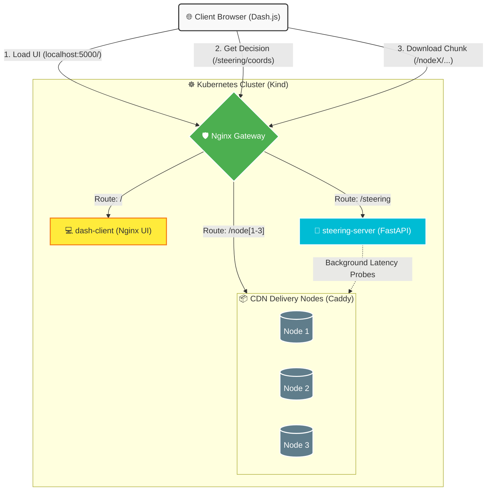

<a id="readme-top"></a>

<!-- PROJECT SHIELDS -->
[![Contributors][contributors-shield]][contributors-url]
[![Forks][forks-shield]][forks-url]
[![Stargazers][stars-shield]][stars-url]
[![Issues][issues-shield]][issues-url]
[![MIT License][license-shield]][license-url]
[![LinkedIn][linkedin-shield]][linkedin-url]

<!-- PROJECT LOGO -->
<br />
<div align="center">
  <h3 align="center">Content Steering with Reinforcement Learning (DASH)</h3>

  <p align="center">
    Research project for simulating Content Steering in DASH streaming with multiple decision strategies, using a Kubernetes-native environment to evaluate performance against real-world network latency.
    <br />
    <a href="https://github.com/alissonpef/Content-Steering"><strong>Explore the docs »</strong></a>
    <br />
    <br />
    <a href="https://www.youtube.com/watch?v=HVMiex63daY">View Demo</a>
    &middot;
    <a href="https://github.com/alissonpef/Content-Steering/issues/new?labels=bug&template=bug-report---.md">Report Bug</a>
    &middot;
    <a href="https://github.com/alissonpef/Content-Steering/issues/new?labels=enhancement&template=feature-request---.md">Request Feature</a>
  </p>
</div>

<!-- TABLE OF CONTENTS -->
<details>
  <summary>Table of Contents</summary>
  <ol>
    <li>
      <a href="#about-the-project">About The Project</a>
      <ul>
        <li><a href="#built-with">Built With</a></li>
      </ul>
    </li>
    <li>
      <a href="#getting-started">Getting Started</a>
      <ul>
        <li><a href="#prerequisites">Prerequisites</a></li>
        <li><a href="#dataset">Dataset</a></li>
        <li><a href="#installation--quick-start">Installation & Quick Start</a></li>
      </ul>
    </li>
    <li><a href="#architecture">Architecture</a></li>
    <li><a href="#analysis-pipeline">Analysis Pipeline</a></li>
    <li><a href="#contributing">Contributing</a></li>
    <li><a href="#license">License</a></li>
    <li><a href="#contact">Contact</a></li>
  </ol>
</details>

<!-- ABOUT THE PROJECT -->
## About The Project

[![Content Steering Screenshot][product-screenshot]](https://github.com/alissonpef/Content-Steering)

This project aims to simulate Content Steering in DASH streaming using multiple decision strategies. It utilizes a Kubernetes-native environment to train and evaluate Reinforcement Learning algorithms against real-world network latency, jitter, and bufferbloat.

Features:
- A FastAPI-based steering service with strategies:
  - `epsilon_greedy`
  - `ucb1`
  - `linucb` (contextual bandit)
  - `thompson_sampling` (contextual Thompson Sampling)
  - `ppo_hybrid` (hybrid PPO policy for bitrate + steering)
  - `sac_hybrid` (hybrid SAC policy for bitrate + steering)
  - `oracle_best_choice`, `random`, `no_steering`
- Kubernetes-native architecture (using Kind) utilizing real cluster latencies.
- 3 simulated cache servers (Delivery Nodes) using Caddy for local HTTPS.
- Full analysis pipeline for log aggregation and graph generation.

<p align="right">(<a href="#readme-top">back to top</a>)</p>

### Built With

* [![Python][Python]][Python-url]
* [![FastAPI][FastAPI]][FastAPI-url]
* [![Kubernetes][Kubernetes]][Kubernetes-url]
* [![Docker][Docker]][Docker-url]
* [![JavaScript][JavaScript]][JavaScript-url]
* [![Nginx][Nginx]][Nginx-url]
* [![Caddy][Caddy]][Caddy-url]

<p align="right">(<a href="#readme-top">back to top</a>)</p>

<!-- GETTING STARTED -->
## Getting Started

To get a local copy up and running follow these simple example steps.

### Prerequisites

* Linux / WSL2
* Python 3.12+
* Docker
* Kind (Kubernetes IN Docker)
* kubectl
* mkcert (For local HTTPS generation)

### Dataset

Download the dataset from:
- [Google Drive Link](https://drive.google.com/drive/folders/1_Mh1JDoRroikzJnjCsZ-Qgqdbx-XP78N?usp=sharing)

Place the `dataset` folder at the project root, like this:
```
./dataset/Eldorado/4sec/avc/manifest.mpd
```

### Installation & Quick Start

1. Clone the repo
   ```sh
   git clone https://github.com/alissonpef/Content-Steering.git
   ```
2. Start the environment (specify your desired strategy: `linucb`, `ucb1`, `epsilon_greedy`, `ppo_hybrid`, `sac_hybrid`, `thompson_sampling`)
   ```sh
   ./infra/scripts/setup_k8s.sh linucb
   ```
3. Access the Interface from your browser:
   [http://localhost:5000](http://localhost:5000)

   If needed, forward the port manually:
   ```sh
   kubectl port-forward deployment/gateway 5000:80
   ```
4. Stop the Environment
   ```sh
   ./infra/scripts/stop_k8s.sh
   ```

<p align="right">(<a href="#readme-top">back to top</a>)</p>


<!-- ARCHITECTURE -->
## Architecture



### Component Breakdown
- **Gateway**: Acts as the single entry point (reverse proxy), securely routing traffic to internal services to avoid CORS issues.
- **dash-client**: Serves the static HTML/JS dashboard and the customized `dash.js` player.
- **steering-server**: The brain of the project. A Python FastAPI service that hosts the Reinforcement Learning agents and measures network topology conditions dynamically.
- **delivery-nodes**: Caddy servers representing edge CDNs, hosting the segmented DASH video chunks and utilizing Linux `tc` (Traffic Control) to emulate variable network jitter and delay.

<p align="right">(<a href="#readme-top">back to top</a>)</p>

<!-- ANALYSIS PIPELINE -->
## Analysis Pipeline

1. **Aggregate logs by strategy**
   ```sh
   python3 analysis/aggregate_logs.py linucb --input_dir data/logs/raw/baseline --output_dir data/logs/aggregated
   ```

2. **Individual-run graphs**
   ```sh
   python3 analysis/plotting/generate_graphs.py data/logs/raw/baseline/log_linucb_1.csv
   ```

3. **Comparative boxplots**
   ```sh
   python3 analysis/plotting/generate_boxplots.py
   ```

4. **Server-choice accuracy analysis**
   ```sh
   python3 analysis/analyze_server_choices.py
   ```

Results are saved in `data/results/` and aggregated logs in `data/logs/aggregated/`.

<p align="right">(<a href="#readme-top">back to top</a>)</p>

<!-- CONTRIBUTING -->
## Contributing

Contributions are what make the open source community such an amazing place to learn, inspire, and create. Any contributions you make are **greatly appreciated**.

If you have a suggestion that would make this better, please fork the repo and create a pull request. You can also simply open an issue with the tag "enhancement".
Don't forget to give the project a star! Thanks again!

1. Fork the Project
2. Create your Feature Branch (`git checkout -b feature/AmazingFeature`)
3. Commit your Changes (`git commit -m 'Add some AmazingFeature'`)
4. Push to the Branch (`git push origin feature/AmazingFeature`)
5. Open a Pull Request

<p align="right">(<a href="#readme-top">back to top</a>)</p>

<!-- LICENSE -->
## License

Distributed under the MIT License. See `LICENSE.txt` for more information.

<p align="right">(<a href="#readme-top">back to top</a>)</p>

<!-- CONTACT -->
## Contact

Álisson Pereira Ferreira - alissonpef@gmail.com

Project Link: [https://github.com/alissonpef/Content-Steering](https://github.com/alissonpef/Content-Steering)

<p align="right">(<a href="#readme-top">back to top</a>)</p>

<!-- ACKNOWLEDGMENTS -->
## Acknowledgments

This project builds upon the excellent work of the following repositories:

* [Content Steering Tutorial](https://github.com/robertovrf/content-steering-tutorial) – the foundational base of this project.
* [Content Steering K8s Simulator](https://github.com/pafev/content-steering-k8s-simulator) – the base used for the real latency simulation environment in Kubernetes.

<p align="right">(<a href="#readme-top">back to top</a>)</p>


<!-- MARKDOWN LINKS & IMAGES -->
<!-- https://www.markdownguide.org/basic-syntax/#reference-style-links -->
[contributors-shield]: https://img.shields.io/github/contributors/alissonpef/Content-Steering.svg?style=for-the-badge
[contributors-url]: https://github.com/alissonpef/Content-Steering/graphs/contributors
[forks-shield]: https://img.shields.io/github/forks/alissonpef/Content-Steering.svg?style=for-the-badge
[forks-url]: https://github.com/alissonpef/Content-Steering/network/members
[stars-shield]: https://img.shields.io/github/stars/alissonpef/Content-Steering.svg?style=for-the-badge
[stars-url]: https://github.com/alissonpef/Content-Steering/stargazers
[issues-shield]: https://img.shields.io/github/issues/alissonpef/Content-Steering.svg?style=for-the-badge
[issues-url]: https://github.com/alissonpef/Content-Steering/issues
[license-shield]: https://img.shields.io/github/license/alissonpef/Content-Steering.svg?style=for-the-badge
[license-url]: https://github.com/alissonpef/Content-Steering/blob/main/LICENSE.txt
[linkedin-shield]: https://img.shields.io/badge/-LinkedIn-black.svg?style=for-the-badge&logo=linkedin&colorB=555
[linkedin-url]: https://www.linkedin.com/in/alisson-pereira-ferreira/
[product-screenshot]: content-steering.png
[Python]: https://img.shields.io/badge/Python-3776AB?style=for-the-badge&logo=python&logoColor=white
[Python-url]: https://www.python.org/
[FastAPI]: https://img.shields.io/badge/FastAPI-009688?style=for-the-badge&logo=fastapi&logoColor=white
[FastAPI-url]: https://fastapi.tiangolo.com/
[Kubernetes]: https://img.shields.io/badge/kubernetes-%23326ce5.svg?style=for-the-badge&logo=kubernetes&logoColor=white
[Kubernetes-url]: https://kubernetes.io/
[Docker]: https://img.shields.io/badge/docker-%230db7ed.svg?style=for-the-badge&logo=docker&logoColor=white
[Docker-url]: https://www.docker.com/
[JavaScript]: https://img.shields.io/badge/javascript-%23323330.svg?style=for-the-badge&logo=javascript&logoColor=%23F7DF1E
[JavaScript-url]: https://developer.mozilla.org/en-US/docs/Web/JavaScript
[Nginx]: https://img.shields.io/badge/nginx-%23009639.svg?style=for-the-badge&logo=nginx&logoColor=white
[Nginx-url]: https://nginx.org/
[Caddy]: https://img.shields.io/badge/caddy-%230e1520.svg?style=for-the-badge&logo=caddy&logoColor=white
[Caddy-url]: https://caddyserver.com/
